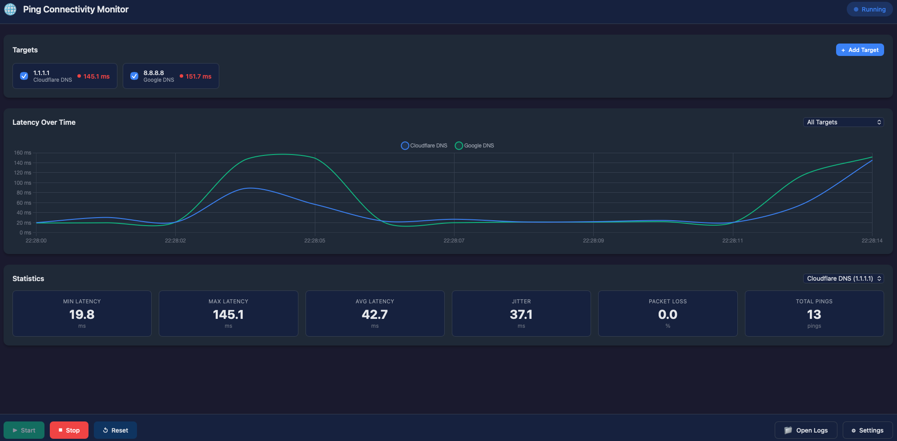

# Ping Connectivity Monitor

A cross-platform desktop application built with Tauri (Rust + Web) that monitors network connectivity by pinging configurable targets and logging the results with real-time statistics and charts.



## Features

- **🎯 Configurable Ping Targets**: Add custom IP addresses or hostnames, with preset options for popular DNS servers (Cloudflare, Google, Quad9, OpenDNS)
- **📊 Real-time Charts**: Live latency visualization using Chart.js with multi-target support
- **📈 Comprehensive Statistics**: Min/Max/Avg latency, jitter, packet loss percentage, and total pings
- **📝 JSON Logging**: Automatic daily log rotation with JSON Lines format for easy parsing
- **🌐 Cross-Platform**: Works on Windows, macOS, and Linux
- **🎨 Modern UI**: Dark theme dashboard with responsive design

## Screenshots

### Main Dashboard
- Real-time latency chart
- Target status indicators with color-coded latency
- Statistics panel with key metrics
- Control buttons for start/stop/reset

### Settings
- Manage ping targets
- Quick-add presets
- Configure ping interval and timeout

## Installation

### Prerequisites

- [Rust](https://rustup.rs/) (1.70 or later)
- [Node.js](https://nodejs.org/) (for development)
- Platform-specific dependencies:
  - **Windows**: No additional dependencies
  - **macOS**: Xcode Command Line Tools
  - **Linux**: `webkit2gtk`, `libappindicator3`, `librsvg2`

### Linux Dependencies

```bash
# Ubuntu/Debian
sudo apt update
sudo apt install libwebkit2gtk-4.1-dev libappindicator3-dev librsvg2-dev patchelf

# Fedora
sudo dnf install webkit2gtk4.1-devel libappindicator-gtk3-devel librsvg2-devel

# Arch
sudo pacman -S webkit2gtk-4.1 libappindicator-gtk3 librsvg
```

### Building from Source

1. Clone the repository:
```bash
git clone https://github.com/yourusername/ping-connectivity.git
cd ping-connectivity
```

2. Build the application:
```bash
cd src-tauri
cargo build --release
```

3. Run the application:
```bash
cargo run --release
```

### Development Mode

For development with hot-reload:

```bash
# Install Tauri CLI
cargo install tauri-cli

# Run in development mode
cargo tauri dev
```

## Usage

### Starting the Monitor

1. Launch the application
2. Click the **Start** button to begin pinging
3. Watch real-time latency updates in the chart and target cards

### Managing Targets

1. Click **+ Add Target** to add a custom target
2. Or click **Settings** to access full target management
3. Use the checkboxes to enable/disable specific targets
4. Click the trash icon to remove a target

### Quick Add Presets

In Settings, use the preset buttons to quickly add popular DNS servers:
- **Cloudflare DNS** (1.1.1.1)
- **Google DNS** (8.8.8.8)
- **Quad9 DNS** (9.9.9.9)
- **OpenDNS** (208.67.222.222)

### Viewing Statistics

- Select a target from the dropdown to view its specific statistics
- Statistics include:
  - **Min Latency**: Lowest recorded latency
  - **Max Latency**: Highest recorded latency
  - **Avg Latency**: Average latency
  - **Jitter**: Latency variation (standard deviation)
  - **Packet Loss**: Percentage of failed pings
  - **Total Pings**: Number of pings sent

### Accessing Logs

Click **Open Logs** to open the log directory in your file explorer.

Log files are stored in:
- **Windows**: `%APPDATA%\ping-connectivity\logs\`
- **macOS**: `~/Library/Application Support/ping-connectivity/logs/`
- **Linux**: `~/.local/share/ping-connectivity/logs/`

Log format (JSON Lines):
```json
{"timestamp":"2025-12-25T12:00:00.000Z","target":"1.1.1.1","target_label":"Cloudflare DNS","latency_ms":12.5,"success":true,"sequence":1,"error":null}
```

## Configuration

### Ping Settings

- **Interval**: Time between pings (default: 1000ms, minimum: 100ms)
- **Timeout**: Maximum wait time for ping response (default: 5000ms)

### Chart Settings

- Select "All Targets" to view all enabled targets on the chart
- Or select a specific target to focus on its latency

## Architecture

```
ping-connectivity/
├── src-tauri/           # Rust backend
│   ├── src/
│   │   ├── main.rs      # Entry point
│   │   ├── lib.rs       # Library exports
│   │   ├── commands.rs  # Tauri commands
│   │   ├── state.rs     # Application state
│   │   ├── models.rs    # Data models
│   │   ├── ping/        # Ping module
│   │   ├── logging/     # JSON logging
│   │   └── stats/       # Statistics calculator
│   └── Cargo.toml
├── src/                 # Web frontend
│   ├── index.html
│   ├── styles.css
│   └── main.js
└── README.md
```

## Technical Details

### Ping Implementation

The application uses the system's native `ping` command for cross-platform compatibility without requiring elevated privileges:
- **Windows**: `ping -n 1 -w <timeout> <target>`
- **macOS**: `ping -c 1 -t <timeout> <target>`
- **Linux**: `ping -c 1 -W <timeout> <target>`

### Statistics Calculation

- **Jitter**: Calculated as the standard deviation of latency values
- **Packet Loss**: `(failed_pings / total_pings) * 100`

### Event System

The backend emits events to the frontend:
- `ping-result`: Emitted after each ping with the result
- `stats-update`: Emitted with updated statistics for all targets

## Troubleshooting

### Ping Not Working

1. Ensure you have network connectivity
2. Check if the target is reachable from your network
3. Some networks may block ICMP packets

### High Latency

1. Check your network connection
2. Try pinging a closer server
3. Check for network congestion

### Application Won't Start

1. Ensure all dependencies are installed
2. Check the console for error messages
3. Try rebuilding the application

## Contributing

Contributions are welcome! Please feel free to submit a Pull Request.

## License

This project is licensed under the MIT License - see the [LICENSE](LICENSE) file for details.

## Acknowledgments

- [Tauri](https://tauri.app/) - Cross-platform app framework
- [Chart.js](https://www.chartjs.org/) - Charting library
- [Rust](https://www.rust-lang.org/) - Systems programming language
