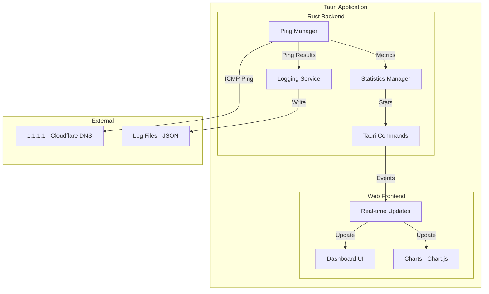

# Ping Connectivity Monitor - Architecture Plan

## Overview

A cross-platform desktop application built with **Tauri** (Rust backend + Web frontend) that continuously pings configurable targets (default: 1.1.1.1) to monitor network connectivity, logs results in JSON format, and displays real-time metrics with charts.

### Key Feature: Configurable Ping Targets
- Default target: 1.1.1.1 (Cloudflare DNS)
- Support for multiple targets simultaneously
- Preset options: 1.1.1.1, 8.8.8.8 (Google), custom IP/hostname
- Per-target statistics and logging

## Technology Stack

### Backend (Rust)
- **Tauri** - Cross-platform desktop app framework
- **surge-ping** - Cross-platform ICMP ping library (works on Windows, macOS, Linux)
- **tokio** - Async runtime for non-blocking ping operations
- **serde/serde_json** - JSON serialization for logging
- **chrono** - Timestamp handling
- **log + env_logger** - Application logging

### Frontend (Web)
- **HTML/CSS/JavaScript** - Core web technologies
- **Chart.js** - Real-time charting library for latency visualization
- **Vanilla JS or Alpine.js** - Lightweight reactivity (no heavy framework needed)

## Architecture Diagram



## Project Structure

```
ping-connectivity/
├── src-tauri/
│   ├── Cargo.toml
│   ├── tauri.conf.json
│   ├── src/
│   │   ├── main.rs              # Tauri entry point
│   │   ├── lib.rs               # Library exports
│   │   ├── ping/
│   │   │   ├── mod.rs           # Ping module
│   │   │   └── pinger.rs        # ICMP ping implementation
│   │   ├── logging/
│   │   │   ├── mod.rs           # Logging module
│   │   │   └── json_logger.rs   # JSON file logging
│   │   ├── stats/
│   │   │   ├── mod.rs           # Statistics module
│   │   │   └── calculator.rs    # Stats calculation
│   │   └── commands.rs          # Tauri commands
│   └── icons/                   # App icons
├── src/
│   ├── index.html               # Main HTML
│   ├── styles.css               # Dashboard styles
│   ├── main.js                  # Frontend logic
│   └── charts.js                # Chart.js configuration
├── logs/                        # JSON log files
├── package.json                 # Frontend dependencies
└── README.md
```

## Data Models

### Ping Target Configuration
```rust
struct PingTarget {
    id: String,               // Unique identifier
    address: String,          // IP or hostname (e.g., "1.1.1.1", "google.com")
    label: String,            // Display name (e.g., "Cloudflare DNS")
    enabled: bool,            // Whether to ping this target
}
```

### App Configuration
```rust
struct AppConfig {
    targets: Vec<PingTarget>,
    ping_interval_ms: u64,    // Default: 1000
    timeout_ms: u64,          // Default: 5000
    max_history_size: usize,  // Default: 100 (for chart)
}
```

### Ping Result
```rust
struct PingResult {
    timestamp: DateTime<Utc>,
    target: String,           // Target address
    target_label: String,     // Target display name
    latency_ms: Option<f64>,  // None if timeout
    success: bool,
    sequence: u32,
    error: Option<String>,
}
```

### Statistics (per target)
```rust
struct PingStatistics {
    target: String,           // Target address
    target_label: String,     // Target display name
    total_pings: u64,
    successful_pings: u64,
    failed_pings: u64,
    packet_loss_percent: f64,
    min_latency_ms: f64,
    max_latency_ms: f64,
    avg_latency_ms: f64,
    jitter_ms: f64,           // Latency variation
    session_start: DateTime<Utc>,
    last_ping: DateTime<Utc>,
}
```

### Log Entry (JSON)
```json
{
  "timestamp": "2025-12-24T22:00:00.000Z",
  "target": "1.1.1.1",
  "latency_ms": 12.5,
  "success": true,
  "sequence": 1,
  "error": null
}
```

## Features

### 1. Configurable Ping Targets
- **Default targets**: 1.1.1.1 (Cloudflare), 8.8.8.8 (Google)
- **Add custom targets**: IP addresses or hostnames
- **Enable/disable targets**: Toggle individual targets on/off
- **Preset quick-add**: Common DNS servers (Cloudflare, Google, Quad9, OpenDNS)
- **Per-target statistics**: Each target has its own stats and chart line

### 2. Continuous Ping Monitoring
- Ping all enabled targets at configurable intervals (default: 1 second)
- Non-blocking async operations (parallel pings to all targets)
- Graceful handling of timeouts and errors

### 2. JSON Logging
- Each ping result logged as JSON line (JSONL format)
- Daily log rotation (e.g., `ping-2025-12-24.json`)
- Logs stored in user data directory

### 3. Real-time Dashboard
- Current connection status (connected/disconnected)
- Live latency display
- Packet loss percentage
- Session statistics

### 4. Charts
- **Line Chart**: Latency over time (last 100 pings)
- **Gauge/Indicator**: Current latency with color coding
  - Green: < 50ms
  - Yellow: 50-100ms
  - Red: > 100ms

### 5. Statistics Panel
- Minimum latency
- Maximum latency
- Average latency
- Jitter (latency variation)
- Total pings sent
- Packet loss percentage
- Session duration

## UI Mockup

### Main Dashboard
```
┌──────────────────────────────────────────────────────────────────────┐
│  🌐 Ping Connectivity Monitor                         [─] [□] [×]    │
├──────────────────────────────────────────────────────────────────────┤
│                                                                      │
│  TARGETS                                                             │
│  ┌────────────────────────────────────────────────────────────────┐ │
│  │ ☑ 1.1.1.1 (Cloudflare)    ● 12.5ms   │ ☑ 8.8.8.8 (Google)  ● 18.2ms │
│  │ ☐ 9.9.9.9 (Quad9)         ○ --       │ [+ Add Target]              │
│  └────────────────────────────────────────────────────────────────┘ │
│                                                                      │
│  ┌────────────────────────────────────────────────────────────────┐ │
│  │   LATENCY OVER TIME                              [1.1.1.1 ▼]   │ │
│  │   ▲                                                            │ │
│  │ ms│    ╭─╮   ╭──╮         ── 1.1.1.1 (blue)                   │ │
│  │   │ ╭──╯ ╰───╯  ╰──╮  ╭─╮ -- 8.8.8.8 (green)                  │ │
│  │   │─╯              ╰──╯ ╰──────────────────────                │ │
│  │   └──────────────────────────────────────────────────▶ time   │ │
│  └────────────────────────────────────────────────────────────────┘ │
│                                                                      │
│  STATISTICS FOR: [1.1.1.1 - Cloudflare ▼]                           │
│  ┌─────────────┐ ┌─────────────┐ ┌─────────────┐ ┌─────────────┐   │
│  │ Min: 8.2ms  │ │ Max: 45.1ms │ │ Avg: 15.3ms │ │ Jitter: 3ms │   │
│  └─────────────┘ └─────────────┘ └─────────────┘ └─────────────┘   │
│  ┌─────────────┐ ┌─────────────┐ ┌─────────────┐                   │
│  │ Loss: 0.5%  │ │ Pings: 1234 │ │ Uptime: 2h  │                   │
│  └─────────────┘ └─────────────┘ └─────────────┘                   │
│                                                                      │
│  [▶ Start] [⏸ Pause] [📁 Open Logs] [⚙ Settings]                   │
└──────────────────────────────────────────────────────────────────────┘
```

### Settings Modal
```
┌─────────────────────────────────────────────────────┐
│  ⚙ Settings                                    [×]  │
├─────────────────────────────────────────────────────┤
│                                                     │
│  PING TARGETS                                       │
│  ┌───────────────────────────────────────────────┐ │
│  │ 1.1.1.1      │ Cloudflare DNS    │ [☑] [🗑]  │ │
│  │ 8.8.8.8      │ Google DNS        │ [☑] [🗑]  │ │
│  │ 9.9.9.9      │ Quad9 DNS         │ [☐] [🗑]  │ │
│  └───────────────────────────────────────────────┘ │
│                                                     │
│  ADD NEW TARGET                                     │
│  Address: [_________________]                       │
│  Label:   [_________________]                       │
│  [+ Add Target]                                     │
│                                                     │
│  QUICK ADD PRESETS                                  │
│  [Cloudflare] [Google] [Quad9] [OpenDNS]           │
│                                                     │
│  PING SETTINGS                                      │
│  Interval: [1000] ms                                │
│  Timeout:  [5000] ms                                │
│                                                     │
│  [Save Settings]                                    │
└─────────────────────────────────────────────────────┘
```

## Tauri Commands (Rust ↔ Frontend Bridge)

| Command | Description | Returns |
|---------|-------------|---------|
| `start_pinging` | Start continuous ping monitoring | void |
| `stop_pinging` | Stop ping monitoring | void |
| `get_statistics` | Get current session statistics (all targets) | Vec of PingStatistics |
| `get_statistics_for_target` | Get stats for specific target | PingStatistics |
| `get_recent_pings` | Get last N ping results | Vec of PingResult |
| `get_log_path` | Get path to log directory | String |
| `set_ping_interval` | Set ping interval in ms | void |
| `get_targets` | Get all configured ping targets | Vec of PingTarget |
| `add_target` | Add a new ping target | PingTarget |
| `remove_target` | Remove a ping target by ID | void |
| `update_target` | Update target settings | PingTarget |
| `toggle_target` | Enable/disable a target | void |
| `get_config` | Get current app configuration | AppConfig |
| `save_config` | Save configuration to disk | void |

## Events (Backend → Frontend)

| Event | Payload | Description |
|-------|---------|-------------|
| `ping-result` | PingResult | Emitted after each ping |
| `stats-update` | PingStatistics | Emitted periodically with updated stats |

## Cross-Platform Considerations

### Windows
- ICMP ping requires raw sockets (may need admin on some systems)
- Alternative: Use Windows ping command as fallback

### macOS
- Raw sockets require root or specific capabilities
- Alternative: Use system ping command with parsing

### Linux
- Raw sockets require CAP_NET_RAW capability or root
- Alternative: Use system ping command with parsing

**Solution**: Use `surge-ping` crate which handles platform differences, with fallback to system ping command if needed.

## Dependencies (Cargo.toml)

```toml
[dependencies]
tauri = { version = "2", features = ["shell-open"] }
serde = { version = "1", features = ["derive"] }
serde_json = "1"
tokio = { version = "1", features = ["full"] }
surge-ping = "0.8"
chrono = { version = "0.4", features = ["serde"] }
log = "0.4"
env_logger = "0.11"
parking_lot = "0.12"
```

## Implementation Steps

1. **Initialize Tauri Project**
   - Create new Tauri v2 project
   - Configure for cross-platform builds

2. **Implement Ping Module**
   - Create async ping function using surge-ping
   - Handle timeouts and errors gracefully
   - Implement fallback to system ping if needed

3. **Implement Logging Module**
   - Create JSON logger with daily rotation
   - Store logs in app data directory
   - Implement log reading for history

4. **Implement Statistics Module**
   - Calculate running statistics
   - Track min/max/avg/jitter
   - Calculate packet loss percentage

5. **Create Tauri Commands**
   - Bridge Rust functions to frontend
   - Implement event emission for real-time updates

6. **Build Frontend Dashboard**
   - Create responsive HTML/CSS layout
   - Integrate Chart.js for latency graph
   - Implement real-time updates via Tauri events

7. **Testing & Polish**
   - Test on macOS, Windows, Linux
   - Handle edge cases
   - Add error handling and user feedback

## Log File Location

Logs will be stored in the platform-specific app data directory:
- **Windows**: `%APPDATA%\ping-connectivity\logs\`
- **macOS**: `~/Library/Application Support/ping-connectivity/logs/`
- **Linux**: `~/.local/share/ping-connectivity/logs/`
